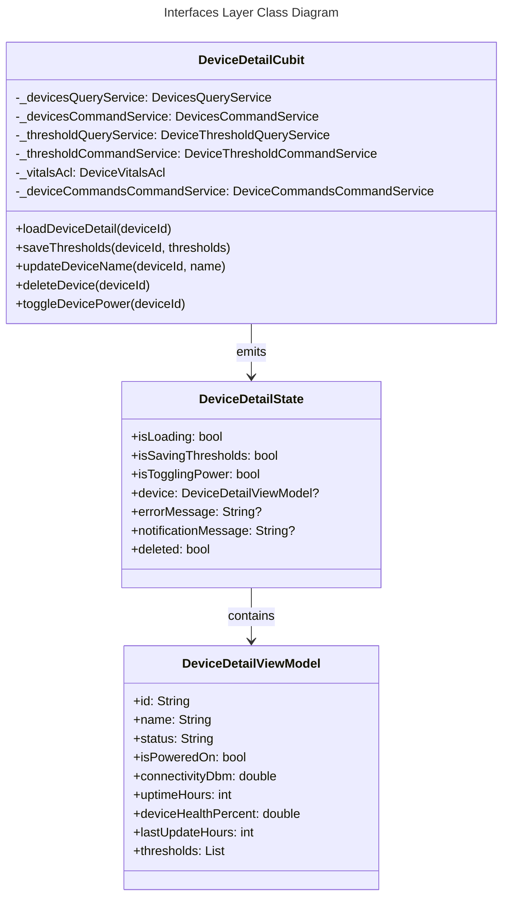
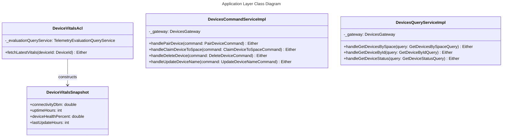
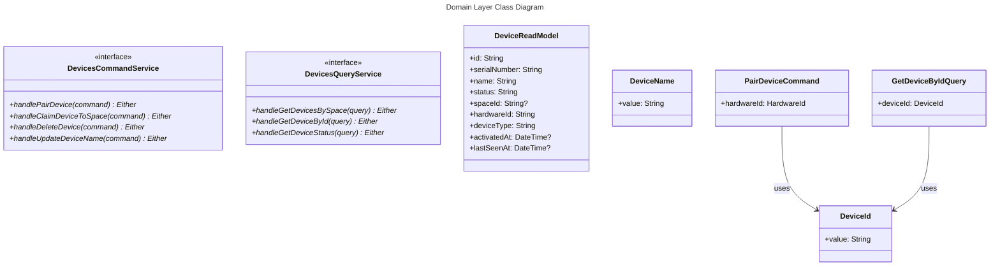
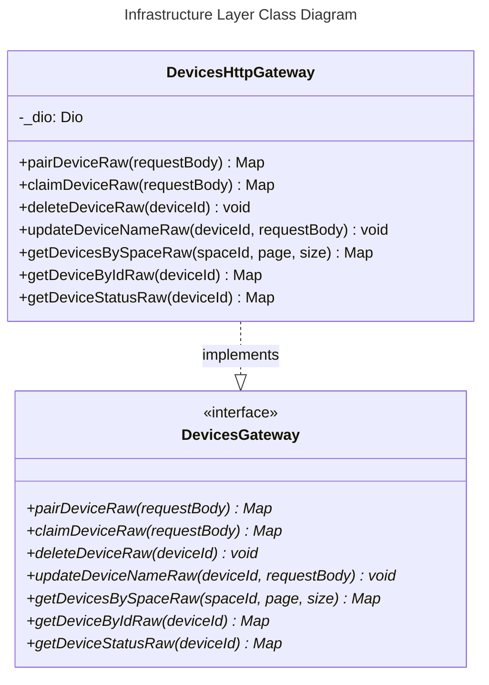

# Unified Class Diagram - Bounded Context: Devices

This document contains the class diagrams for the **Devices** Bounded Context structured across the 4 layers of Clean Architecture / DDD (Interfaces, Application, Domain, and Infrastructure).

---

## 1. Unified Class Diagram

```mermaid
---
title: DDD Class Diagram - Devices Bounded Context (Unified)
---

classDiagram

namespace interfaces {
    class DeviceDetailCubit {
        -_devicesQueryService: DevicesQueryService
        -_devicesCommandService: DevicesCommandService
        -_thresholdQueryService: DeviceThresholdQueryService
        -_thresholdCommandService: DeviceThresholdCommandService
        -_vitalsAcl: DeviceVitalsAcl
        -_deviceCommandsCommandService: DeviceCommandsCommandService
        +loadDeviceDetail(deviceId)
        +saveThresholds(deviceId, thresholds)
        +updateDeviceName(deviceId, name)
        +deleteDevice(deviceId)
        +toggleDevicePower(deviceId)
    }

    class DeviceDetailState {
        +isLoading: bool
        +isSavingThresholds: bool
        +isTogglingPower: bool
        +device: DeviceDetailViewModel?
        +errorMessage: String?
        +notificationMessage: String?
        +deleted: bool
    }

    class DeviceDetailViewModel {
        +id: String
        +name: String
        +status: String
        +isPoweredOn: bool
        +connectivityDbm: double
        +uptimeHours: int
        +deviceHealthPercent: double
        +lastUpdateHours: int
        +thresholds: List
    }
}

namespace application {
    class DeviceVitalsAcl {
        -_evaluationQueryService: TelemetryEvaluationQueryService
        +fetchLatestVitals(deviceId: DeviceId) Either
    }

    class DeviceVitalsSnapshot {
        +connectivityDbm: double
        +uptimeHours: int
        +deviceHealthPercent: double
        +lastUpdateHours: int
    }

    class DevicesCommandServiceImpl {
        -_gateway: DevicesGateway
        +handlePairDevice(command: PairDeviceCommand) Either
        +handleClaimDeviceToSpace(command: ClaimDeviceToSpaceCommand) Either
        +handleDeleteDevice(command: DeleteDeviceCommand) Either
        +handleUpdateDeviceName(command: UpdateDeviceNameCommand) Either
    }

    class DevicesQueryServiceImpl {
        -_gateway: DevicesGateway
        +handleGetDevicesBySpace(query: GetDevicesBySpaceQuery) Either
        +handleGetDeviceById(query: GetDeviceByIdQuery) Either
        +handleGetDeviceStatus(query: GetDeviceStatusQuery) Either
    }
}

namespace domain {
    class DevicesCommandService {
        <<interface>>
        +handlePairDevice(command) Either*
        +handleClaimDeviceToSpace(command) Either*
        +handleDeleteDevice(command) Either*
        +handleUpdateDeviceName(command) Either*
    }

    class DevicesQueryService {
        <<interface>>
        +handleGetDevicesBySpace(query) Either*
        +handleGetDeviceById(query) Either*
        +handleGetDeviceStatus(query) Either*
    }

    class DeviceReadModel {
        +id: String
        +serialNumber: String
        +name: String
        +status: String
        +spaceId: String?
        +hardwareId: String
        +deviceType: String
        +activatedAt: DateTime?
        +lastSeenAt: DateTime?
    }

    class DeviceId {
        +value: String
    }

    class DeviceName {
        +value: String
    }

    class PairDeviceCommand {
        +hardwareId: HardwareId
    }

    class GetDeviceByIdQuery {
        +deviceId: DeviceId
    }
}

namespace infrastructure {
    class DevicesGateway {
        <<interface>>
        +pairDeviceRaw(requestBody) Map*
        +claimDeviceRaw(requestBody) Map*
        +deleteDeviceRaw(deviceId) void*
        +updateDeviceNameRaw(deviceId, requestBody) void*
        +getDevicesBySpaceRaw(spaceId, page, size) Map*
        +getDeviceByIdRaw(deviceId) Map*
        +getDeviceStatusRaw(deviceId) Map*
    }

    class DevicesHttpGateway {
        -_dio: Dio
        +pairDeviceRaw(requestBody) Map
        +claimDeviceRaw(requestBody) Map
        +deleteDeviceRaw(deviceId) void
        +updateDeviceNameRaw(deviceId, requestBody) void
        +getDevicesBySpaceRaw(spaceId, page, size) Map
        +getDeviceByIdRaw(deviceId) Map
        +getDeviceStatusRaw(deviceId) Map
    }
}

%% Relationships between layers

%% Interfaces to Application and Domain
DeviceDetailCubit --> DevicesQueryService : uses
DeviceDetailCubit --> DevicesCommandService : uses
DeviceDetailCubit --> DeviceVitalsAcl : uses
DeviceDetailCubit --> DeviceDetailState : emits
DeviceDetailState --> DeviceDetailViewModel : contains

%% Application to Domain and Infrastructure
DeviceVitalsAcl --> DeviceVitalsSnapshot : constructs
DevicesCommandServiceImpl ..|> DevicesCommandService : implements
DevicesCommandServiceImpl --> DevicesGateway : uses
DevicesCommandServiceImpl --> PairDeviceCommand : processes

DevicesQueryServiceImpl ..|> DevicesQueryService : implements
DevicesQueryServiceImpl --> DevicesGateway : uses
DevicesQueryServiceImpl --> GetDeviceByIdQuery : processes
DevicesQueryServiceImpl --> DeviceReadModel : returns

%% Domain
PairDeviceCommand --> DeviceId : uses
GetDeviceByIdQuery --> DeviceId : uses

%% Infrastructure to Domain
DevicesHttpGateway ..|> DevicesGateway : implements
```

---

## 2. Layer-Specific Class Diagrams

### 2.1 Interfaces Layer
Focuses on UI interaction, presentation models, and state management components.

### 2.2 Application Layer
Orchestrates application logic, maps models, and integrates with the Anti-Corruption Layer (ACL).

### 2.3 Domain Layer
The core layer containing Business logic contracts, Command/Query definitions, Value Objects, and Read Models.

### 2.4 Infrastructure Layer
Handles data persistence, serialization/deserialization, and communication with the API.

