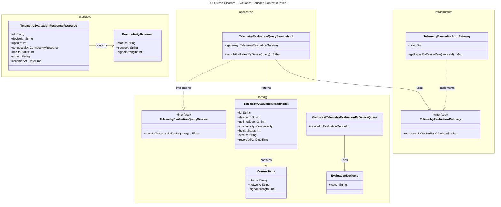
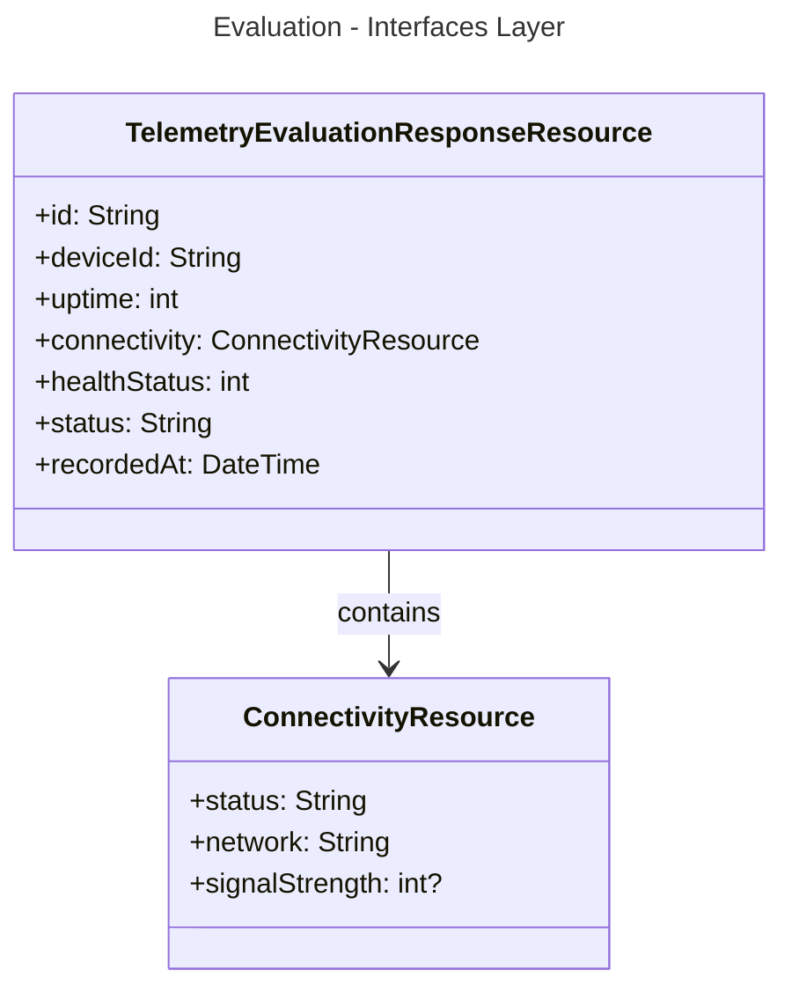
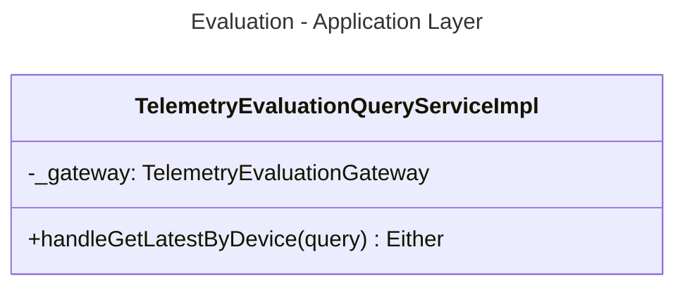
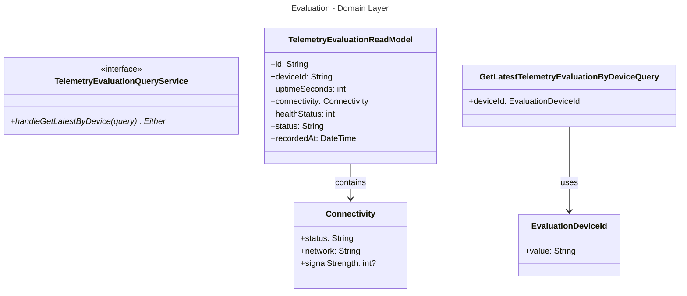
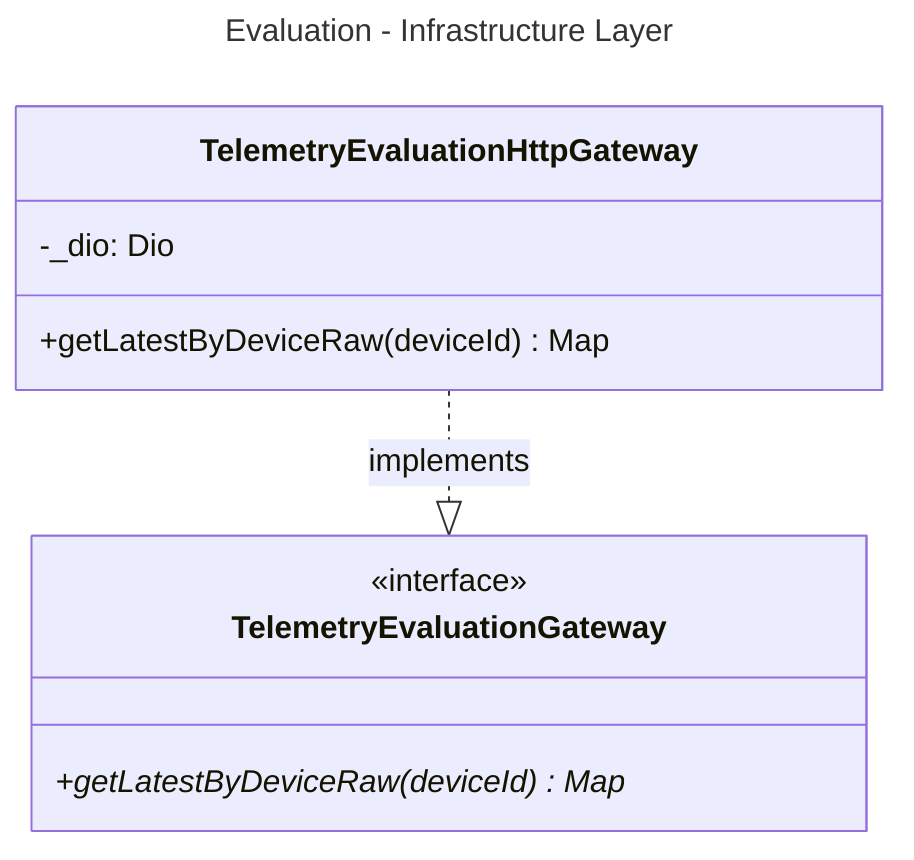

# Unified Class Diagram - Bounded Context: Evaluation

This document contains the class diagrams for the **Evaluation** Bounded Context structured across the 4 layers of Clean Architecture / DDD (Interfaces, Application, Domain, and Infrastructure).

---

## 1. Unified Class Diagram

---

## 2. Layer-Specific Class Diagrams

### 2.1 Interfaces Layer
*(Note: Evaluation has no pages or Cubits as its UI presentation is integrated into the Devices Bounded Context via ACL)*

### 2.2 Application Layer

### 2.3 Domain Layer

### 2.4 Infrastructure Layer

