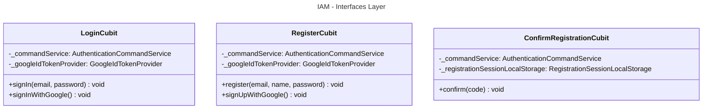
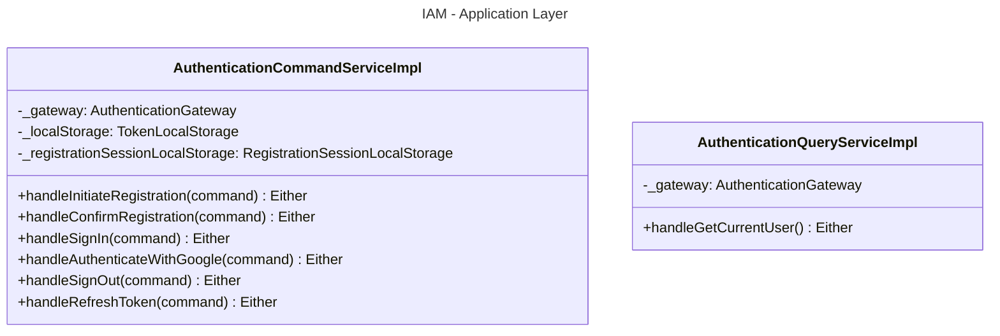
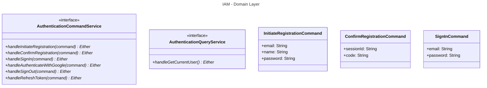
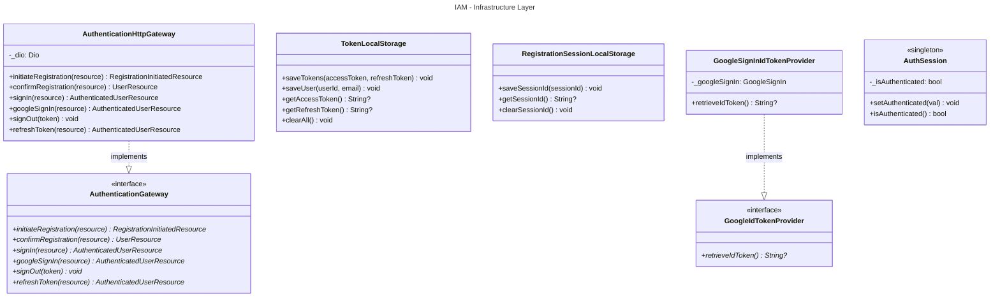

# Unified Class Diagram - Bounded Context: IAM

This document contains the class diagrams for the **IAM** (Identity & Access Management) Bounded Context structured across the 4 layers of Clean Architecture / DDD (Interfaces, Application, Domain, and Infrastructure).

---

## 1. Unified Class Diagram

```mermaid
---
title: DDD Class Diagram - IAM Bounded Context (Unified)
---

classDiagram

namespace interfaces {
    class LoginCubit {
        -_commandService: AuthenticationCommandService
        -_googleIdTokenProvider: GoogleIdTokenProvider
        +signIn(email, password) void
        +signInWithGoogle() void
    }

    class RegisterCubit {
        -_commandService: AuthenticationCommandService
        -_googleIdTokenProvider: GoogleIdTokenProvider
        +register(email, name, password) void
        +signUpWithGoogle() void
    }

    class ConfirmRegistrationCubit {
        -_commandService: AuthenticationCommandService
        -_registrationSessionLocalStorage: RegistrationSessionLocalStorage
        +confirm(code) void
    }
}

namespace application {
    class AuthenticationCommandServiceImpl {
        -_gateway: AuthenticationGateway
        -_localStorage: TokenLocalStorage
        -_registrationSessionLocalStorage: RegistrationSessionLocalStorage
        +handleInitiateRegistration(command) Either
        +handleConfirmRegistration(command) Either
        +handleSignIn(command) Either
        +handleAuthenticateWithGoogle(command) Either
        +handleSignOut(command) Either
        +handleRefreshToken(command) Either
    }

    class AuthenticationQueryServiceImpl {
        -_gateway: AuthenticationGateway
        +handleGetCurrentUser() Either
    }
}

namespace domain {
    class AuthenticationCommandService {
        <<interface>>
        +handleInitiateRegistration(command) Either*
        +handleConfirmRegistration(command) Either*
        +handleSignIn(command) Either*
        +handleAuthenticateWithGoogle(command) Either*
        +handleSignOut(command) Either*
        +handleRefreshToken(command) Either*
    }

    class AuthenticationQueryService {
        <<interface>>
        +handleGetCurrentUser() Either*
    }

    class InitiateRegistrationCommand {
        +email: String
        +name: String
        +password: String
    }

    class ConfirmRegistrationCommand {
        +sessionId: String
        +code: String
    }

    class SignInCommand {
        +email: String
        +password: String
    }
}

namespace infrastructure {
    class AuthenticationGateway {
        <<interface>>
        +initiateRegistration(resource) RegistrationInitiatedResource*
        +confirmRegistration(resource) UserResource*
        +signIn(resource) AuthenticatedUserResource*
        +googleSignIn(resource) AuthenticatedUserResource*
        +signOut(token) void*
        +refreshToken(resource) AuthenticatedUserResource*
    }

    class AuthenticationHttpGateway {
        -_dio: Dio
        +initiateRegistration(resource) RegistrationInitiatedResource
        +confirmRegistration(resource) UserResource
        +signIn(resource) AuthenticatedUserResource
        +googleSignIn(resource) AuthenticatedUserResource
        +signOut(token) void
        +refreshToken(resource) AuthenticatedUserResource
    }

    class TokenLocalStorage {
        +saveTokens(accessToken, refreshToken) void
        +saveUser(userId, email) void
        +getAccessToken() String?
        +getRefreshToken() String?
        +clearAll() void
    }

    class RegistrationSessionLocalStorage {
        +saveSessionId(sessionId) void
        +getSessionId() String?
        +clearSessionId() void
    }

    class GoogleIdTokenProvider {
        <<interface>>
        +retrieveIdToken() String?*
    }

    class GoogleSignInIdTokenProvider {
        -_googleSignIn: GoogleSignIn
        +retrieveIdToken() String?
    }
    
    class AuthSession {
        <<singleton>>
        -_isAuthenticated: bool
        +setAuthenticated(val) void
        +isAuthenticated() bool
    }
}

%% Relationships between layers

%% Interfaces to Application and Domain
LoginCubit --> AuthenticationCommandService : uses
LoginCubit --> GoogleIdTokenProvider : uses
RegisterCubit --> AuthenticationCommandService : uses
RegisterCubit --> GoogleIdTokenProvider : uses
ConfirmRegistrationCubit --> AuthenticationCommandService : uses

%% Application to Domain and Infrastructure
AuthenticationCommandServiceImpl ..|> AuthenticationCommandService : implements
AuthenticationCommandServiceImpl --> AuthenticationGateway : uses
AuthenticationCommandServiceImpl --> TokenLocalStorage : uses
AuthenticationCommandServiceImpl --> RegistrationSessionLocalStorage : uses
AuthenticationCommandServiceImpl --> AuthSession : uses
AuthenticationCommandServiceImpl --> InitiateRegistrationCommand : processes

AuthenticationQueryServiceImpl ..|> AuthenticationQueryService : implements
AuthenticationQueryServiceImpl --> AuthenticationGateway : uses

%% Infrastructure to Domain/Core
AuthenticationHttpGateway ..|> AuthenticationGateway : implements
GoogleSignInIdTokenProvider ..|> GoogleIdTokenProvider : implements
```

---

## 2. Layer-Specific Class Diagrams

### 2.1 Interfaces Layer

### 2.2 Application Layer

### 2.3 Domain Layer

### 2.4 Infrastructure Layer

