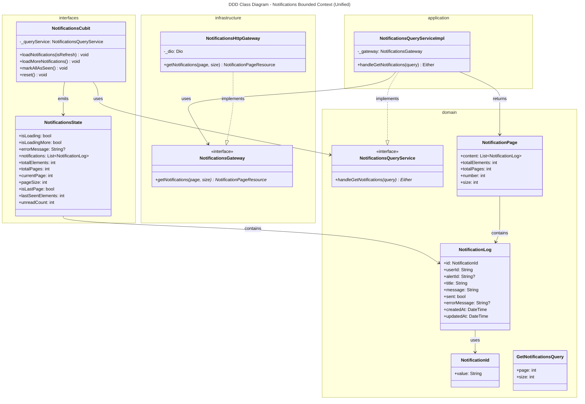
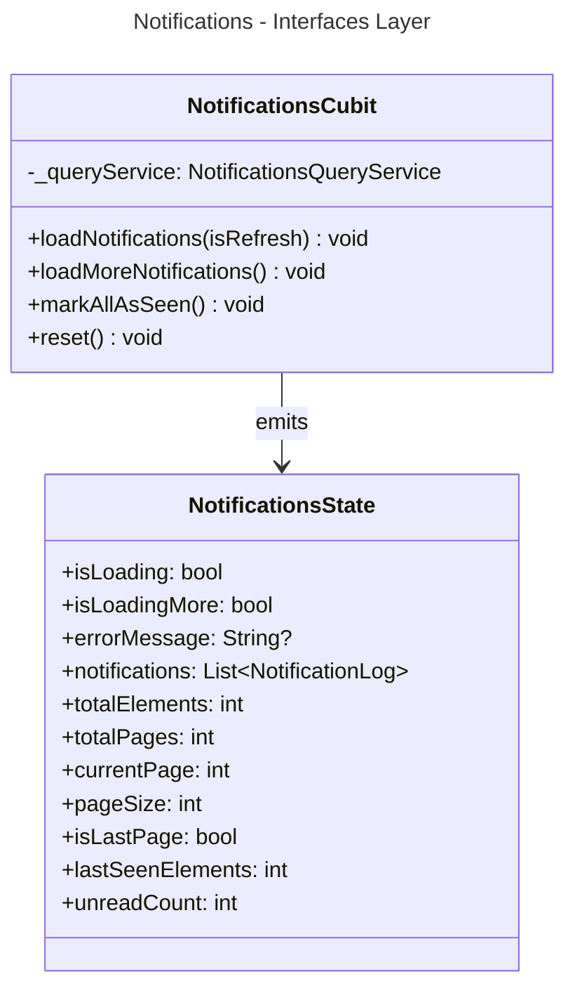
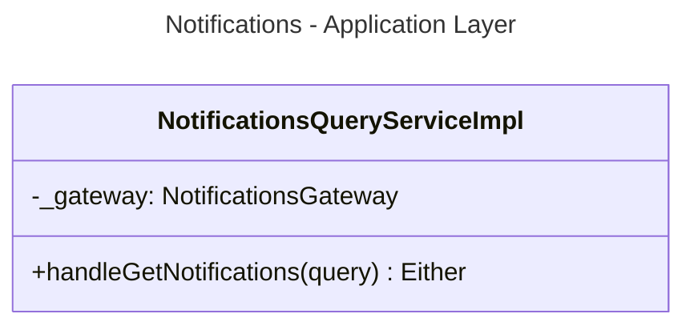
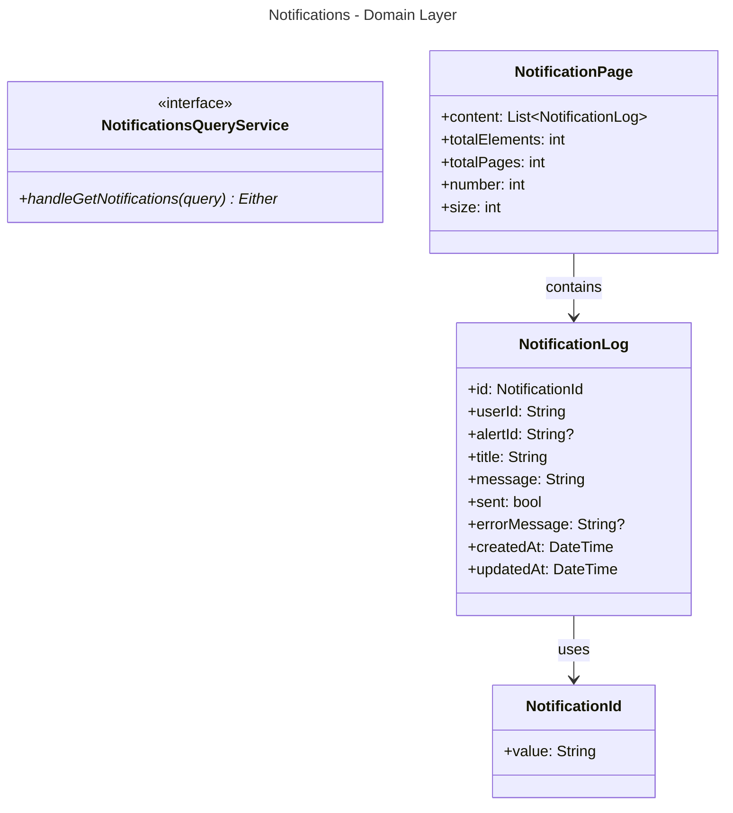
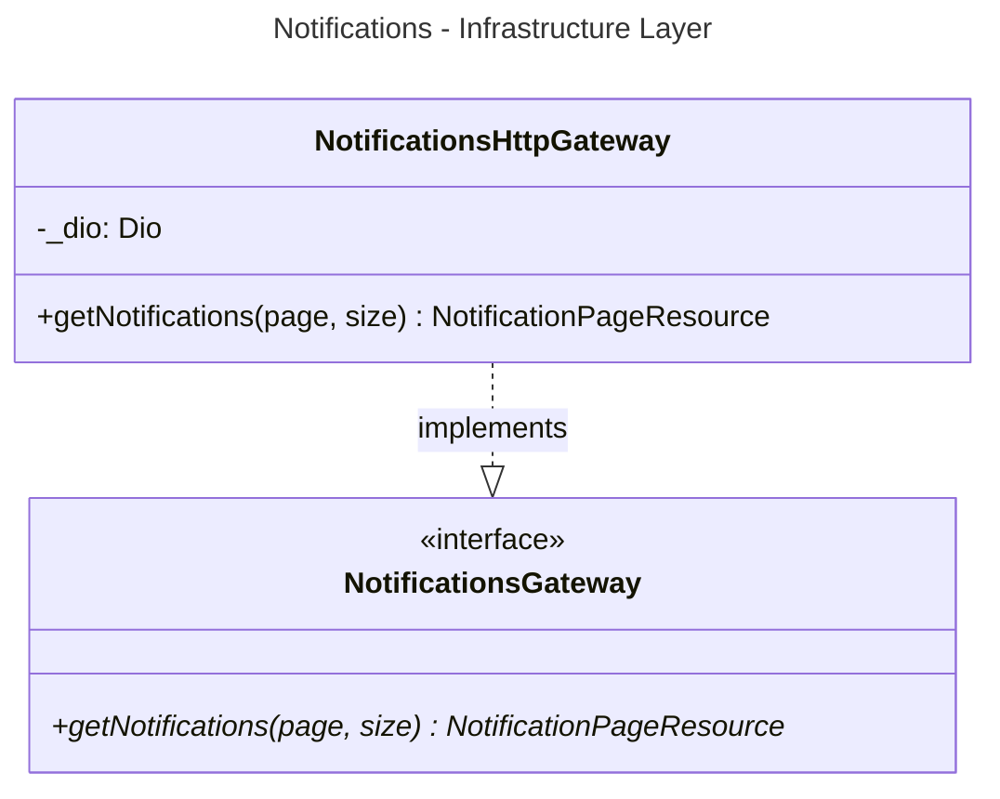

# Unified Class Diagram - Bounded Context: Notifications

This document contains the class diagrams for the **Notifications** Bounded Context structured across the 4 layers of Clean Architecture / DDD (Interfaces, Application, Domain, and Infrastructure).

---

## 1. Unified Class Diagram

---

## 2. Layer-Specific Class Diagrams

### 2.1 Interfaces Layer

### 2.2 Application Layer

### 2.3 Domain Layer

### 2.4 Infrastructure Layer

