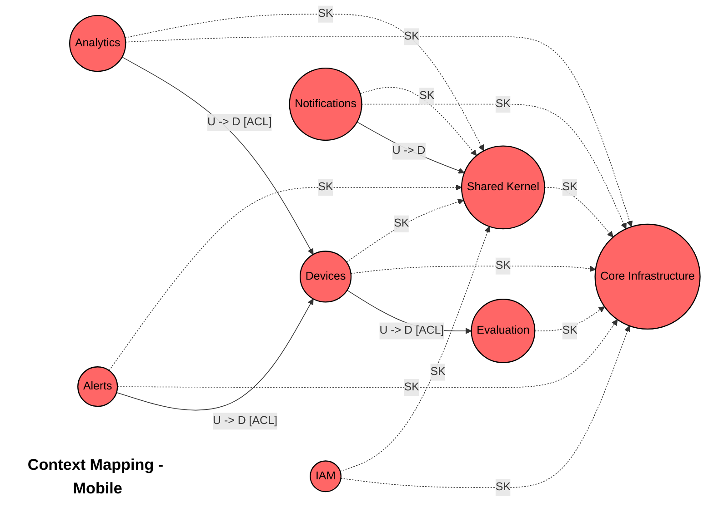

# Context Mapping

This document contains the Context Mapping diagram for the mobile (Flutter) application.

## Context Mapping Diagram

```mermaid
flowchart LR
    %% Context Mapping - Mobile

    title["Context Mapping - Mobile"]

    IAM(("IAM"))
    Devices(("Devices"))
    Alerts(("Alerts"))
    Analytics(("Analytics"))
    Evaluation(("Evaluation"))
    Notifications(("Notifications"))
    Core(("Core Infrastructure"))
    Shared(("Shared Kernel"))

    %% Domain relationships
    Alerts -->|"U -> D [ACL]"| Devices
    Analytics -->|"U -> D [ACL]"| Devices
    Devices -->|"U -> D [ACL]"| Evaluation

    %% Shared Kernel & Layout dependencies
    Notifications -->|"U -> D"| Shared
    
    %% Cross-cutting Core infrastructure
    IAM -.->|"SK"| Core
    Devices -.->|"SK"| Core
    Alerts -.->|"SK"| Core
    Analytics -.->|"SK"| Core
    Evaluation -.->|"SK"| Core
    Notifications -.->|"SK"| Core
    Shared -.->|"SK"| Core

    %% Shared Widgets dependencies
    IAM -.->|"SK"| Shared
    Devices -.->|"SK"| Shared
    Alerts -.->|"SK"| Shared
    Analytics -.->|"SK"| Shared
    Notifications -.->|"SK"| Shared

    title ~~~ IAM

    classDef context fill:#ff6666,stroke:#000,stroke-width:1.5px,color:#000;
    classDef titleNode fill:transparent,stroke:transparent,color:#000,font-size:22px,font-weight:bold;

    class IAM,Devices,Alerts,Analytics,Evaluation,Notifications,Core,Shared context;
    class title titleNode;
```
